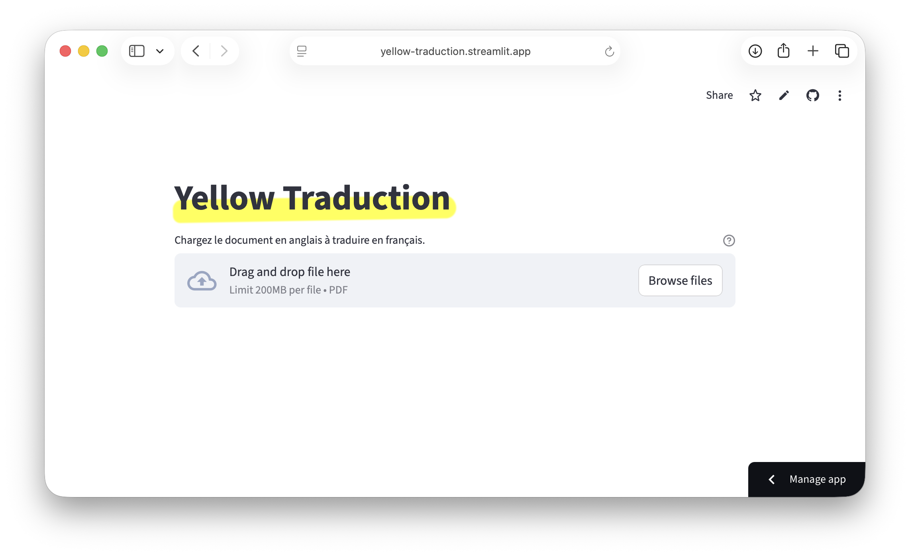

# Yellow Traduction

## Description

%%%%%
%%%%%

---

## 📌 Qu’est-ce que %%%%% ?

%%%%%
%%%%%

---

## 🎯 Objectif du projet

Le projet vise à :

- %%%%%
  - %%%%%
  - %%%%%
- %%%%%
- %%%%%
  - %%%%%
  - %%%%%
- %%%%%

%%%%%
%%%%%

---

## 🚀 Cas d’usage

- %%%%%
- %%%%%
- %%%%%
- %%%%%

---

## 👥 Public cible

- **%%%%%**
- **%%%%%**

---

## ⚙️ Fonctionnalités actuelles

- %%%%%
  - %%%%%
  - %%%%%
- %%%%%
- %%%%%
  - %%%%%
  - %%%%%
- %%%%%

---

## 🖥️ Interface graphique

Le fichier `streamlit_app.py` implémente l’interface Streamlit décrite ci-dessus.



---

## 🧠 Fonctionnement général

1. %%%%%
2. %%%%%
3. %%%%%
   - %%%%%
   - %%%%%
   - %%%%%
4. %%%%%

---

## 🗂️ Structure du repository

```text
Yellow Traduction/
├── .github/
├── dashboard/
│   ├── Dockerfile
│   ├── requirements.txt
│   └── streamlit_app.py
├── docs/
│   └── images/Capture.png
├── scripts/
│   ├── Traduction_PDF_multicore.ipynb
│   └── Traduction_PDF.ipynb
├── CHANGELOG.md
├── LICENSE.md
├── CODE_OF_CONDUCT.md
├── CONTRIBUTING.md
├── SECURITY.md
└── ACKNOWLEDGEMENTS.md
```

---

## 🐳 Installation & déploiement

Le projet est prévu pour être déployé :

- %%%%%
- %%%%%

### Environnement

- **Python ≥ 3.13.5**
- Dépendances listées dans `requirements.txt`

---

## 🧪 État du projet

- 🔬 **Statut** : expérimental
- 🧭 **Roadmap** : à définir

---

## 🔒 Licence

- Voir `LICENSE.md`

---

## 🤝 Contributions

- Voir `CONTRIBUTING.md`
- Code de conduite disponible dans `CODE_OF_CONDUCT.md`

---

## 👤 Auteur

**Gauthier RAMMAULT**